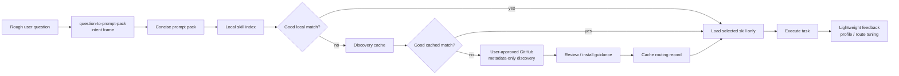

# Question to Prompt Pack

> One unified entry point: understand a rough question, generate the smallest useful prompt pack, then route the task to the right Codex skill when needed.

[](https://github.com/HPSummer/question-to-prompt-pack/actions/workflows/validate.yml)

Question to Prompt Pack is a Codex skill for improving user-AI communication. It does not simply make prompts longer. It helps an AI quickly decide whether to answer directly, ask one clarifying question, show a compact collaboration frame, generate a prompt pack, or route the task to the best skill for execution.

中文说明见 [README.zh-CN.md](README.zh-CN.md).

## Quick Demo

User:

```text
I want to build a personal research productivity MVP.
```

Question to Prompt Pack:

```text
I understand this as:
- Goal: design a small research productivity tool users can build and test quickly
- Missing/assumed context: assume solo researcher, Codex/Cursor development, notes + tasks + papers
- Best output: PRD-style MVP plan
- Mode: tiny planning + route

Prompt pack:
Help me design a personal research productivity tool MVP. Focus on the minimum usable workflow for capturing research tasks, linking papers/notes, planning weekly execution, and reviewing progress. Output a PRD-style plan with user stories, core screens, data model, implementation phases, and validation checks.

Route:
- Task type: research/planning
- Best skill: research-execution-copilot
- Confidence: medium
- Next action: recommend route, then load selected skill if confirmed
```

## Why This Exists

Many prompt tools over-expand simple requests. This skill is designed around one rule:

```text
Use the smallest frame that prevents misunderstanding.
```

Unified chain:

```text
rough user question
-> question-to-prompt-pack aligns intent
-> concise prompt pack
-> installed local skills
-> local discovery cache
-> first-run GitHub metadata-only discovery
-> review/install guidance
-> selected skill executes the task
-> feedback updates prompt/routing preference
```

It helps with:

- turning plain-language questions into structured prompts
- avoiding overthinking and token waste
- showing a concise, user-editable interpretation before execution
- deciding which Codex skill should execute the task
- teaching one reusable questioning pattern when useful
- preserving non-sensitive collaboration preferences in a local profile
- preserving the user's natural style
- adapting to thread-level preferences through lightweight feedback

## 3-Minute Quick Start

```powershell
git clone https://github.com/HPSummer/question-to-prompt-pack.git
cd question-to-prompt-pack
.\install.ps1
```

Restart or refresh Codex, then try:

```text
Use $question-to-prompt-pack:
I want to build a personal research productivity MVP, but I do not know how to structure the task.
```

Verify the package:

```powershell
python .\question-to-prompt-pack\scripts\run_quality_checks.py --repo-root .
```

## Why People Adopt It

| Problem | What this skill does |
|---|---|
| Prompt rewrites become too long | Starts with a tiny frame and expands only when needed |
| AI misunderstands vague requests | Makes goal, missing context, output, and mode visible |
| Too many skills are installed | Routes from compact metadata and loads one skill by default |
| Remote skill discovery feels risky | Reads GitHub `SKILL.md` metadata only and never auto-installs |
| Teams need repeatable behavior | Ships examples, benchmark cases, and CI-friendly validation |

## Who It Is For

| User | Best first use |
|---|---|
| Researchers and students | Turn rough research ideas into executable plans and prompts |
| Codex/Cursor power users | Decide which skill should handle a task |
| Skill authors | Add benchmark cases and validate routing behavior |
| Teams experimenting with AI workflows | Standardize safe prompt framing and skill discovery |

## Architecture



## Core Behaviors

| Mode | Use when | Token policy |
|---|---|---|
| Tiny Frame | default for ordinary requests | 4 bullets + 1 prompt |
| Compact Frame | user wants to inspect the AI's understanding | 7 one-line fields |
| Full Frame | complex task needs assumptions, constraints, and quality criteria | expand only when needed |
| Training Frame | user wants coaching on how to ask better | diagnosis + exercise + template |
| Skill Route | specialized workflow should execute the framed task | load one best skill by default |
| Direct Execution | user says to just do the task | skip framing and execute |

## Question Coaching Loop

When the user wants to improve questioning ability, or when a request is missing a high-leverage detail, add a tiny coaching block:

```text
Question upgrade:
- Missing piece:
- Why it matters:
- Reusable pattern:
```

Default pattern:

```text
Goal + context + output format + constraints + execution mode
```

Do not force coaching into ordinary execution requests.

## Installation

Recommended:

```powershell
.\install.ps1
```

Manual install:

```powershell
Copy-Item -LiteralPath .\question-to-prompt-pack -Destination "$env:USERPROFILE\.codex\skills\question-to-prompt-pack" -Recurse -Force
```

Then restart or refresh Codex so the skill list is reloaded.

## Usage

Use it as the only front door:

```text
Use $question-to-prompt-pack:
Understand my rough request, generate a concise prompt pack, choose the best skill if useful, and avoid overthinking.
```

Initialize a local user style profile:

```powershell
python .\question-to-prompt-pack\scripts\profile_manager.py --init --validate
```

Build a local skill index:

```powershell
python .\question-to-prompt-pack\scripts\build_local_index.py --out skill-index.json
```

Validate the unified benchmark:

```powershell
python .\question-to-prompt-pack\scripts\validate_unified_cases.py --cases .\benchmarks\unified-cases.jsonl
```

Run all repository quality checks:

```powershell
python .\question-to-prompt-pack\scripts\run_quality_checks.py --repo-root .
```

## Routing Benchmark Snapshot

The benchmark currently includes 50 realistic user-style requests across research, coding, writing, PDF/data, image, video, automation, decision-making, and ambiguous inputs.

| Area | Cases | Expected behavior |
|---|---:|---|
| Prompt framing | 10 | choose tiny/compact/full/training without over-expansion |
| Skill routing | 18 | route only when a specialized skill is useful |
| Direct execution | 8 | skip framing when the request is already clear |
| Ambiguous/high-risk | 8 | ask one clarification or add verification |
| Discovery/cache | 6 | use local/cache first, GitHub metadata only after approval |

## Promotion and Demos

Use [examples/before-after.md](examples/before-after.md) for realistic transformations and [examples/promotion-copy.md](examples/promotion-copy.md) for a 30-second pitch, one-line description, and launch copy.
Use [docs/adoption-playbook.md](docs/adoption-playbook.md) for launch positioning, post templates, and a 7-day promotion plan.

Good demo prompts:

```text
Use $question-to-prompt-pack: I want to build a personal research productivity MVP.
Use $question-to-prompt-pack: Help me decide which Codex skill should handle this task.
Use $question-to-prompt-pack: Train my questioning ability for research planning.
```

## Skill Discovery and Routing

Default routing order:

```text
installed local skills
-> local discovery cache
-> first-run GitHub metadata-only discovery
-> user review/install guidance
-> later route from local/cache
```

First-run discovery for a new task category:

```powershell
python .\question-to-prompt-pack\scripts\route_with_discovery.py "build a React dashboard" --local-index skill-index.json --discover
```

Discovery reads only GitHub `SKILL.md` metadata. It does not auto-install or execute remote code. After the user approves and installs a skill, later requests use the local index or `.question-to-prompt-pack/skill-discovery-cache.json` instead of repeatedly searching GitHub.

Configure approved discovery sources by copying `sources.example.json` to `.question-to-prompt-pack/sources.json`:

```json
{
  "refresh_policy": "weekly",
  "sources": [
    {
      "name": "openai-skills",
      "url": "https://github.com/openai/skills",
      "enabled": true,
      "trust_level": "review"
    }
  ]
}
```

## Repository Layout

```text
question-to-prompt-pack/
  SKILL.md
  agents/openai.yaml
  references/
  assets/
  scripts/
benchmarks/
  unified-cases.jsonl
examples/
  before-after.md
  promotion-copy.md
docs/
  adoption-playbook.md
  release-notes-v0.8.0.md
```

## Contributing

See [CONTRIBUTING.md](CONTRIBUTING.md). The short version: keep `SKILL.md` small, put detailed guidance in `references/`, add benchmark cases for routing changes, and run `run_quality_checks.py` before a PR.

## License

MIT. See [LICENSE](LICENSE).
