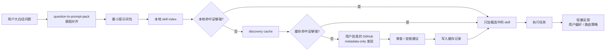

# Question to Prompt Pack

> 一个统一入口：先理解大白话问题，生成最小提示词包，再判断应该直接回答、追问、规划，还是调用对应的 Codex skill。

[](https://github.com/HPSummer/question-to-prompt-pack/actions/workflows/validate.yml)

Question to Prompt Pack 是一个 Codex skill，用来提升用户和 AI 的沟通效率。它不是把提示词越写越长，而是帮助 AI 快速判断：应该直接执行、先问一个关键问题、展示简洁协作框架、生成完整提示词包，还是路由到最合适的 skill 执行。

English version: [README.md](README.md)

## 快速效果

用户输入：

```text
我想做一个个人科研效率工具 MVP，不知道怎么设计。
```

输出风格：

```text
我理解为：
- 目标：设计一个可快速开发和验证的个人科研效率工具
- 缺失/假设：默认面向个人研究者，包含任务、论文、笔记和周计划
- 最佳输出：Cursor/Codex 可开发的 PRD
- 模式：tiny planning + route

提示词包：
请帮我设计一个个人科研效率工具 MVP，聚焦最小可用流程：科研任务捕获、论文/笔记链接、周计划、进度复盘。请输出 PRD，包括用户故事、核心页面、数据模型、开发阶段和验证标准。

路由：
- Task type: research/planning
- Best skill: research-execution-copilot
- Confidence: medium
- Next action: 推荐路由，确认后只加载该 skill
```

## 设计目标

核心规则：

```text
用最小的框架，避免最大的误解。
```

统一链路：

```text
用户大白话问题
-> question-to-prompt-pack 对齐意图
-> 生成最小提示词包
-> 本地已安装 skills 检索
-> 本地 discovery cache 检索
-> 首次 GitHub metadata-only 发现
-> 引导用户审查/安装候选 skill
-> 后续直接从本地或缓存路由
-> 对应 skill 执行任务
-> 反馈结果回到用户偏好/路由策略
```

它解决的问题：

- 把自然语言问题转成结构化提示词
- 避免过度思考和 token 浪费
- 在执行前展示可编辑的理解框架
- 判断这件事是否应该调用某个 skill
- 用一句可复用模式训练用户下次怎么问
- 用本地 profile 保留非敏感协作偏好
- 保留用户原本的大白话风格
- 根据反馈形成当前线程的工作偏好

## 3 分钟快速开始

```powershell
git clone https://github.com/HPSummer/question-to-prompt-pack.git
cd question-to-prompt-pack
.\install.ps1
```

重启或刷新 Codex，然后试：

```text
使用 $question-to-prompt-pack：
我想做一个个人科研效率工具 MVP，不知道怎么设计。
```

验证安装包：

```powershell
python .\question-to-prompt-pack\scripts\run_quality_checks.py --repo-root .
```

## 为什么值得安装

| 常见问题 | 这个 skill 的处理方式 |
|---|---|
| 提示词越改越长 | 默认 tiny frame，只在需要时展开 |
| AI 容易误解模糊需求 | 明确目标、缺失上下文、输出形态和执行模式 |
| skills 太多不知道用哪个 | 先查紧凑 metadata，默认只加载 1 个最佳 skill |
| GitHub skill 发现有安全顾虑 | 只读取 `SKILL.md` metadata，不自动安装、不执行远程代码 |
| 想让别人信任和复用 | 提供 examples、benchmark 和 CI 质量检查 |

## 适合谁

| 用户 | 第一个使用场景 |
|---|---|
| 科研学生/研究者 | 把粗糙科研想法转成可执行计划和提示词 |
| Codex/Cursor 重度用户 | 判断一个任务该交给哪个 skill |
| skill 作者 | 增加 benchmark，并验证路由行为 |
| 正在测试 AI workflow 的团队 | 统一安全的 prompt framing 和 skill discovery |

## 架构图



## 核心模式

| 模式 | 使用场景 | Token 策略 |
|---|---|---|
| Tiny Frame | 默认模式，普通问题 | 4 个要点 + 1 个提示词 |
| Compact Frame | 用户想检查 AI 如何理解问题 | 7 个字段，每项一行 |
| Full Frame | 复杂任务，需要假设、约束和质量标准 | 只在明确需要时展开 |
| Training Frame | 用户想训练提问能力 | 诊断 + 练习 + 模板 |
| Skill Route | 任务需要专门 skill 执行 | 只加载 1 个最佳 skill |
| Direct Execution | 用户明确说“直接做” | 跳过框架，直接执行 |

## 提问训练闭环

只有当用户明确想提升提问能力，或问题明显缺少关键上下文时，才输出一个很短的训练块：

```text
提问升级：
- 缺失信息：
- 为什么重要：
- 下次复用模板：
```

默认模板：

```text
目标 + 背景 + 输出格式 + 约束 + 执行模式
```

普通执行请求不会强行教学，避免浪费 token。

## 安装

推荐一键安装：

```powershell
.\install.ps1
```

手动安装：

```powershell
Copy-Item -LiteralPath .\question-to-prompt-pack -Destination "$env:USERPROFILE\.codex\skills\question-to-prompt-pack" -Recurse -Force
```

然后重启或刷新 Codex，让技能列表重新加载。

## 使用

最常用：

```text
使用 $question-to-prompt-pack：
先理解我的需求，生成最小提示词包，判断是否需要调用 skill；能直接做就直接做，避免过度分析。
```

检查理解框架：

```text
使用 $question-to-prompt-pack：
请先展示你如何理解我的问题框架，让我调整后再生成最终提示词，并判断应该调用哪个 skill。
```

直接生成最终提示词：

```text
使用 $question-to-prompt-pack：
直接把下面的问题改成最终提示词，不要展示框架。
```

初始化本地用户风格 profile：

```powershell
python .\question-to-prompt-pack\scripts\profile_manager.py --init --validate
```

构建本地 skill index：

```powershell
python .\question-to-prompt-pack\scripts\build_local_index.py --out skill-index.json
```

运行完整质量检查：

```powershell
python .\question-to-prompt-pack\scripts\run_quality_checks.py --repo-root .
```

## Skill 发现与调用

默认路由顺序：

```text
本地已安装 skills
-> 本地 discovery cache
-> 首次 GitHub metadata-only 发现
-> 引导用户审查/安装
-> 后续直接用本地或缓存索引路由
```

首次发现新类型 skill：

```powershell
python .\question-to-prompt-pack\scripts\route_with_discovery.py "build a React dashboard" --local-index skill-index.json --discover
```

发现流程只读取 GitHub 上的 `SKILL.md` metadata，不会自动安装，也不会执行远程代码。用户批准并安装后，后续同类任务优先走本地索引或 `.question-to-prompt-pack/skill-discovery-cache.json`，不需要反复搜索 GitHub。

配置批准的发现源：把 `sources.example.json` 复制为 `.question-to-prompt-pack/sources.json` 后按需修改。

```json
{
  "refresh_policy": "weekly",
  "sources": [
    {
      "name": "openai-skills",
      "url": "https://github.com/openai/skills",
      "enabled": true,
      "trust_level": "review"
    }
  ]
}
```

## Benchmark

验证统一链路 benchmark：

```powershell
python .\question-to-prompt-pack\scripts\validate_unified_cases.py --cases .\benchmarks\unified-cases.jsonl
```

当前 benchmark 包含 50 条真实用户风格问题，覆盖科研、代码、写作、PDF/数据、图像、视频、自动化、决策和模糊输入。

| 领域 | 用例数 | 期望行为 |
|---|---:|---|
| 提示词框架 | 10 | tiny/compact/full/training 自动选择，不默认长篇展开 |
| Skill 路由 | 18 | 只有任务需要专门工作流时才路由 |
| 直接执行 | 8 | 用户要求直接做时跳过框架 |
| 模糊/高风险 | 8 | 只问一个关键问题或增加验证 |
| 发现/缓存 | 6 | 本地和缓存优先，GitHub 只做 metadata-only 发现 |

## 推广和演示材料

- [examples/before-after.md](examples/before-after.md)：真实 before/after 示例
- [examples/promotion-copy.md](examples/promotion-copy.md)：30 秒介绍、一句话简介、发布文案
- [docs/adoption-playbook.md](docs/adoption-playbook.md)：定位、发布模板、7 天推广计划

推荐演示输入：

```text
使用 $question-to-prompt-pack：我想做一个个人科研效率工具 MVP。
使用 $question-to-prompt-pack：帮我判断这个任务该调用哪个 Codex skill。
使用 $question-to-prompt-pack：训练我做科研任务规划时的提问能力。
```

## 目录结构

```text
question-to-prompt-pack/
  SKILL.md
  agents/openai.yaml
  references/
  assets/
  scripts/
benchmarks/
  unified-cases.jsonl
examples/
  before-after.md
  promotion-copy.md
docs/
  adoption-playbook.md
  release-notes-v0.8.0.md
```

## 参与贡献

见 [CONTRIBUTING.md](CONTRIBUTING.md)。原则很简单：`SKILL.md` 保持小而清晰，细节放到 `references/`，路由策略变更要补 benchmark，用 PR 前先运行 `run_quality_checks.py`。

## 许可证

MIT。见 [LICENSE](LICENSE)。
